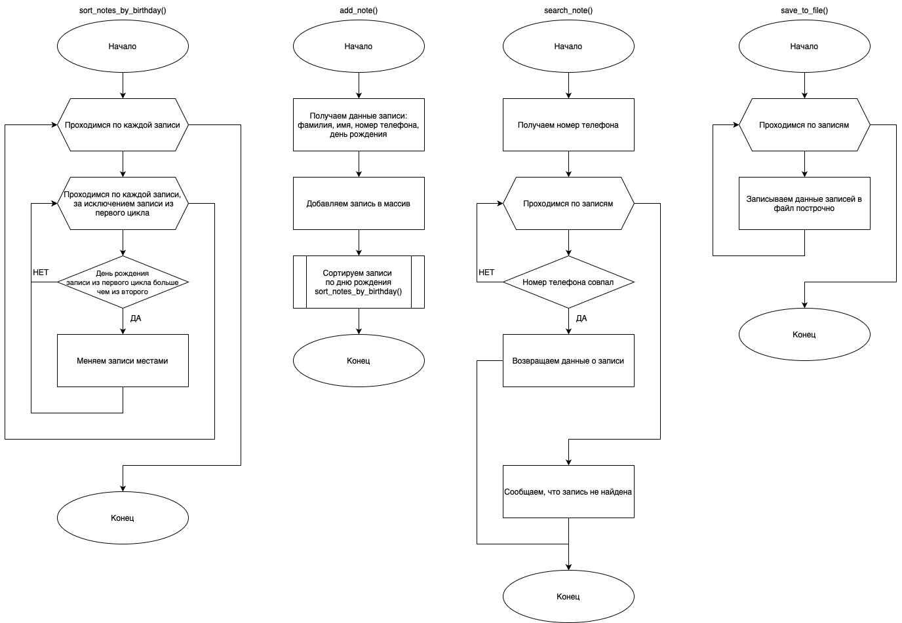
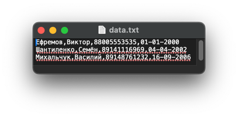
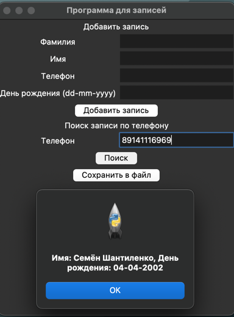

# Практическая работа №16 #

### Тема: Разработка документа «Текст программы» ###

### Цель: "Приобрести навыки составления программ с использованием строк" ###
#### Вариант №12 ####
#### Задача: ####


1. Описать запись с именем Note, содержащую следующие поля: 
    * фамилия, имя;
    * номер телефона;
    * день рождения (массив из трех чисел).

2. Написать программу, выполняющую следующие действия:
    * ввод данных с клавиатуры в массив, состоящий из восьми элементов типа Note; записи должны быть упорядочены по датам дней рождения;
    * вывод на экран информации о человеке, номер телефона которого введен с клавиатуры; если такого нет, вывести на экран соответствующее сообщение;
    * запись массива в файл под заданным с клавиатуры именем.

##### Контрольный пример: #####

> Добавление записей  
> Ввожу: "  
surname = Михальчук; name = Василий; phone = 89148761232; birthday_str = 16-09-2006;   
surname = Ефремов; name = Виктор; phone = 88005553535; birthday_str = 01-01-2000;    
surname = Шантиленко; name = Семён; phone = 89141116969; birthday_str = 04-04-2002;    
"  
> Получаю: "extracted_file.txt"  


> Поиск записи  
> Ввожу: "phone = 89141116969" 
> Получаю: "Имя: Семён Шантиленко, День рождения: 04-04-2002"
##### Системный анализ: #####

>Входные данные: `str surname`, `str name`, `str phone`, `str birthday_str`  
>Промежуточные данные данные: `list notes`, `file_name`  
>Выходные данные: `file data.txt`, `list note`    

##### Блок схема: #####



##### Код программы: #####

```python
import tkinter as tk
from tkinter import messagebox
from datetime import datetime


class Note:
    def __init__(self, surname, name, phone, birthday):
        self.surname = surname
        self.name = name
        self.phone = phone
        self.birthday = birthday


def sort_notes_by_birthday(notes):
    for i in range(len(notes)):
        for j in range(i + 1, len(notes)):
            if notes[i].birthday > notes[j].birthday:
                notes[i], notes[j] = notes[j], notes[i]


def add_note():
    if len(notes) >= 8:
        messagebox.showerror("Ошибка", "Можно добавить только до 8 записей")
        return

    surname = entry_surname.get()
    name = entry_name.get()
    phone = entry_phone.get()
    birthday_str = entry_birthday.get()

    if not surname or not name or not phone or not birthday_str:
        messagebox.showerror("Ошибка", "Все поля обязательны для заполнения")
        return

    if not phone.isdigit():
        messagebox.showerror("Ошибка", "Номер телефона должен содержать только цифры")
        return

    try:
        birthday = datetime.strptime(birthday_str, "%d-%m-%Y").date()
    except ValueError:
        messagebox.showerror("Ошибка", "Неверный формат даты. Используйте dd-mm-yyyy.")
        return

    note = Note(surname, name, phone, birthday)
    notes.append(note)
    sort_notes_by_birthday(notes)

    messagebox.showinfo("Успех", "Запись успешно добавлена")
    clear_fields()


def search_note():
    phone = entry_search_phone.get()

    if not phone.isdigit():
        messagebox.showerror("Ошибка", "Номер телефона должен содержать только цифры")
        return

    for note in notes:
        if note.phone == phone:
            messagebox.showinfo("Результат",
                                f"Имя: {note.name} {note.surname}, День рождения: {note.birthday.strftime('%d-%m-%Y')}")
            return

    messagebox.showinfo("Результат", "Запись с указанным номером телефона не найдена")


def save_to_file():
    file_name = "/Users/vill/Desktop/tex/Ucheb_PR/UP_PR_16/data.txt"

    with open(file_name, 'w') as file:
        for note in notes:
            file.write(f"{note.surname},{note.name},{note.phone},{note.birthday.strftime('%d-%m-%Y')}\n")
    messagebox.showinfo("Сохранение", "Данные успешно сохранены")


def clear_fields():
    entry_surname.delete(0, tk.END)
    entry_name.delete(0, tk.END)
    entry_phone.delete(0, tk.END)
    entry_birthday.delete(0, tk.END)


notes = []

root = tk.Tk()
root.title("Программа для записей")

# Секция добавления записи
tk.Label(root, text="Добавить запись").grid(row=0, columnspan=2)

tk.Label(root, text="Фамилия").grid(row=1, column=0)
entry_surname = tk.Entry(root)
entry_surname.grid(row=1, column=1)

tk.Label(root, text="Имя").grid(row=2, column=0)
entry_name = tk.Entry(root)
entry_name.grid(row=2, column=1)

tk.Label(root, text="Телефон").grid(row=3, column=0)
entry_phone = tk.Entry(root)
entry_phone.grid(row=3, column=1)

tk.Label(root, text="День рождения (dd-mm-yyyy)").grid(row=4, column=0)
entry_birthday = tk.Entry(root)
entry_birthday.grid(row=4, column=1)

tk.Button(root, text="Добавить запись", command=add_note).grid(row=5, columnspan=2)

# Секция поиска записи
tk.Label(root, text="Поиск записи по телефону").grid(row=6, columnspan=2)

tk.Label(root, text="Телефон").grid(row=7, column=0)
entry_search_phone = tk.Entry(root)
entry_search_phone.grid(row=7, column=1)

tk.Button(root, text="Поиск", command=search_note).grid(row=8, columnspan=2)

# Секция сохранения записей
tk.Button(root, text="Сохранить в файл", command=save_to_file).grid(row=9, columnspan=2)

root.mainloop()

```

##### Результат работы программы: #####
> Оконное:    
* Вводим:   
`surname = Михальчук; name = Василий; phone = 89148761232; birthday_str = 16-09-2006`    
`surname = Ефремов; name = Виктор; phone = 88005553535; birthday_str = 01-01-2000`    
`surname = Шантиленко; name = Семён; phone = 89141116969; birthday_str = 04-04-2002`  


> Оконное:    
* Вводим:   
`phone = 89141116969`    


##### Вывод по проделанной работе: #####
> В ходе данной практики я поработал с файлами, использовнием их в роли баз данных, а также с поиском записей и сортировкой по дате.